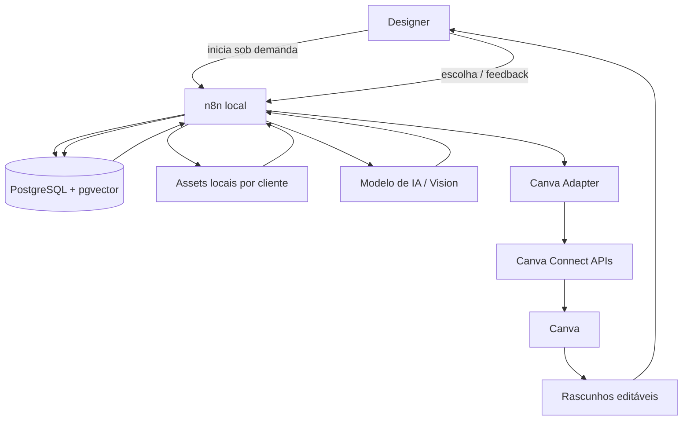
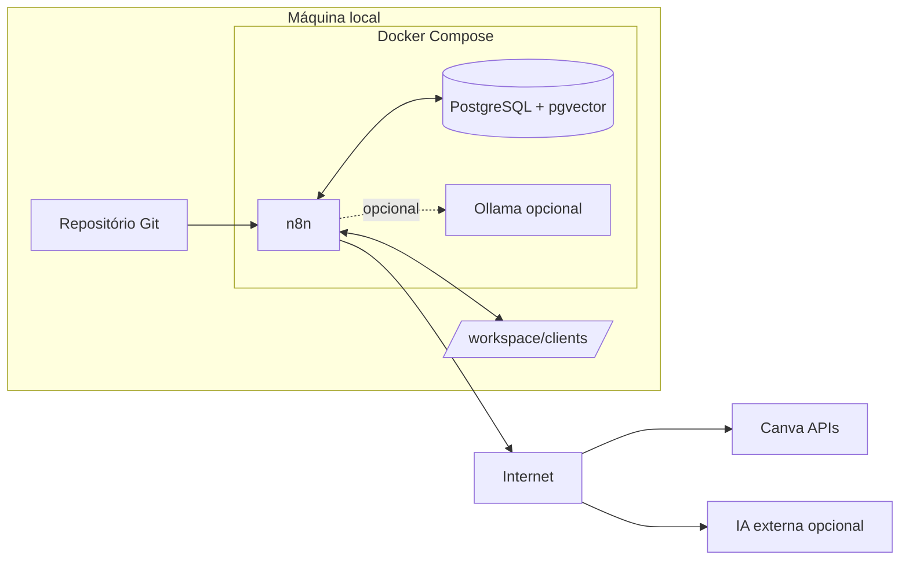
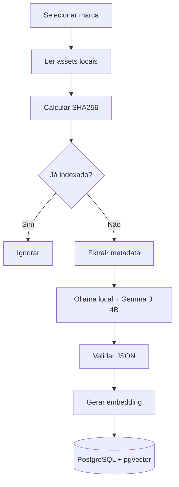
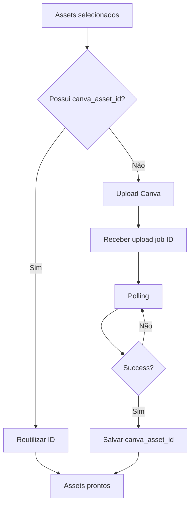
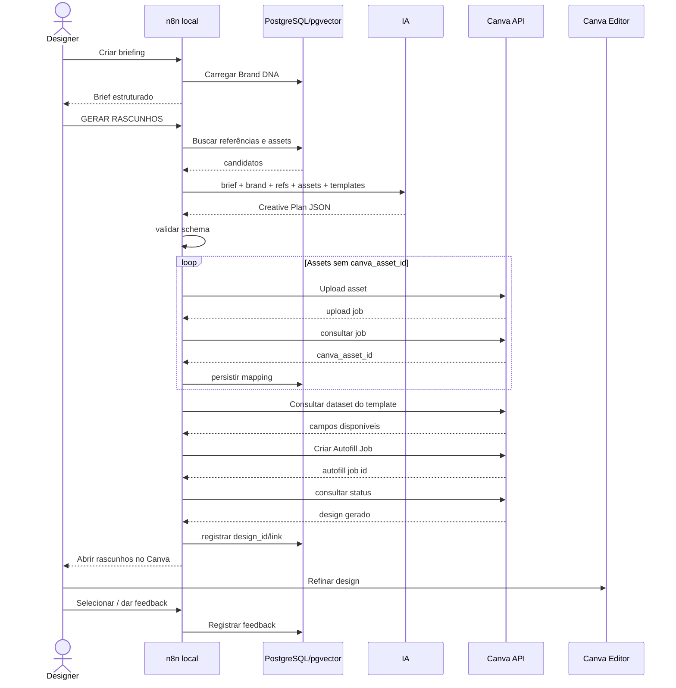

# Arquitetura do Sistema de Automação de Rascunhos de Design com n8n + Canva

**Status:** Especificação inicial de arquitetura para MVP  
**Versão:** 0.2 — Canva-first  
**Data:** 16/09/2026  
**Objetivo do documento:** servir como fonte de verdade para a futura implementação usando n8n, Canva Connect APIs, Codex, Claude Code e Cursor.

---

## 1. Visão do projeto

O sistema tem como objetivo acelerar a produção diária de peças de social media de uma agência de moda.

O sistema **não tem como objetivo substituir o designer** e **não deverá gerar fotografias ou imagens sintéticas**. Seu papel é automatizar o trabalho operacional que antecede a finalização manual de uma peça:

- localizar os melhores assets de cada cliente;
- interpretar o briefing;
- recuperar referências visuais já aprovadas;
- aplicar regras de identidade visual;
- selecionar um template adequado;
- definir a estrutura de cada slide;
- preencher automaticamente templates no Canva;
- produzir um ou mais rascunhos editáveis;
- entregar links dos rascunhos ao designer;
- registrar a escolha e o feedback realizado pelo designer.

A saída principal do sistema será um **design editável dentro do Canva**, e não um arquivo gráfico final gerado localmente.

---

## 2. Premissas obrigatórias

1. O n8n será executado **localmente na máquina do designer**.
2. Nenhum workflow de criação será executado automaticamente por agenda.
3. Os workflows serão iniciados somente quando houver demanda de um cliente.
4. O n8n funcionará como **orquestrador**, não como editor gráfico.
5. O Canva funcionará como **motor de template, composição e edição final**.
6. Assets de uma marca nunca poderão ser recuperados para outra marca.
7. A IA poderá analisar imagens existentes, mas não deverá gerar novas imagens.
8. A IA será usada para decisões semânticas e criativas; Canva e regras estruturadas executarão o layout.
9. A publicação em redes sociais não faz parte do MVP.
10. Sempre haverá revisão humana antes de uma peça ser considerada final.
11. O sistema deverá iniciar com uma única marca, poucos templates e um único formato de peça.
12. O fato de o n8n estar local não significa que o sistema será offline: Canva e, caso utilizados, provedores de IA externos exigirão acesso à internet.

---

## 3. Princípio central da arquitetura

O sistema será dividido em três responsabilidades.

### 3.1. IA decide

A camada de IA poderá:

- interpretar o briefing;
- pesquisar referências internas;
- selecionar fotografias candidatas;
- escolher o template;
- definir qual imagem entra em qual slide;
- propor headline, subheadline e CTA quando solicitado;
- escolher variação de logo quando o template permitir;
- sugerir direção visual;
- gerar o plano estruturado do carrossel;
- comparar resultados com o Brand DNA.

### 3.2. n8n orquestra

O n8n será responsável por:

- receber a demanda;
- executar as rodadas do sistema;
- consultar banco de dados;
- ler os assets locais;
- chamar modelos de IA;
- validar respostas em JSON;
- sincronizar assets selecionados com Canva quando necessário;
- chamar a Canva Connect API;
- acompanhar jobs assíncronos;
- registrar IDs, links, estados e logs;
- apresentar os rascunhos ao designer.

### 3.3. Canva executa e mantém o arquivo editável

O Canva será responsável por:

- manter os templates oficiais;
- preservar tipografia, grids, logos, margens e identidade visual;
- preencher campos de texto e imagem;
- criar novas cópias dos designs/templates;
- manter os rascunhos editáveis;
- permitir a finalização manual do designer.

A IA **não deve montar livremente cada elemento em uma tela vazia no MVP**. Ela deverá escolher e preencher estruturas previamente preparadas no Canva.

---

# 4. Arquitetura geral



---

# 5. Stack recomendada para o MVP

## 5.1. Orquestração

**n8n self-hosted em Docker**, executado na máquina local.

Principais responsabilidades:

- workflow manual;
- comunicação com PostgreSQL;
- comunicação com APIs de IA;
- leitura de assets locais;
- chamadas HTTP à Canva Connect API;
- polling de jobs assíncronos;
- validação de schemas;
- histórico de execução.

### Triggers previstos

- `Manual Trigger` para rotinas administrativas;
- `Form Trigger`, `Chat Trigger` ou Webhook local para briefing;
- `Execute Sub-workflow` para módulos reutilizáveis.

Nenhum `Schedule Trigger` será necessário no MVP.

---

## 5.2. Banco de dados

**PostgreSQL + pgvector**, local via Docker.

O banco armazenará:

- marcas;
- Brand DNA;
- metadados de assets;
- análises visuais;
- embeddings;
- referências de design;
- templates Canva disponíveis;
- datasets/campos de autofill dos templates;
- vínculo entre asset local e `canva_asset_id`;
- jobs criativos;
- Creative Plans;
- rascunhos Canva;
- feedback;
- histórico de execução.

---

## 5.3. Armazenamento local

As imagens originais podem continuar organizadas localmente.

Exemplo:

```text
/workspace/
  clients/
    marca_a/
      brand/
      assets/
      references/
    marca_b/
      ...
```

O Canva **não precisa ser o repositório mestre de todas as imagens**.

Estratégia recomendada para o MVP:

1. banco local continua sendo a fonte de verdade dos assets;
2. IA seleciona as imagens necessárias para aquele job;
3. somente os assets escolhidos são enviados ao Canva, se ainda não estiverem lá;
4. o `canva_asset_id` retornado é persistido no PostgreSQL;
5. futuras execuções reutilizam esse ID e evitam upload duplicado.

### Vantagem

Isso evita subir milhares de fotografias ao Canva antes de saber se serão utilizadas.

---

## 5.4. Canva Adapter

Em vez de um renderer local, o projeto terá um pequeno módulo lógico chamado **Canva Adapter**.

Ele poderá existir inicialmente apenas como sub-workflows + HTTP Request nodes do n8n.

Futuramente poderá virar um pequeno serviço Node.js se a lógica de autenticação, retry e tratamento de API crescer.

### Responsabilidades

- autenticação OAuth 2.0 / PKCE;
- refresh de token;
- listar Brand Templates;
- consultar dataset/campos de um template;
- subir assets ao Canva;
- mapear asset local → Canva asset ID;
- iniciar job de Autofill;
- consultar status do Autofill;
- recuperar o design gerado;
- retornar `design_id` e URL para o n8n.

### Interfaces conceituais

```text
ensureAssetInCanva(asset_id)
getTemplateDataset(template_id)
createDraftFromTemplate(template_id, data)
getDraftStatus(job_id)
getDesign(design_id)
```

O restante do sistema não deverá depender diretamente dos detalhes da Canva API.

---

## 5.5. Restrição de plano do Canva

A arquitetura preferencial usa **Brand Templates + Autofill**.

Para produção, a capacidade oficial de Autofill da Connect API atualmente exige que a integração atue em nome de um usuário de uma organização **Canva Enterprise**. Durante desenvolvimento, contas pagas podem possuir acesso limitado de teste conforme as regras da plataforma.

Portanto, antes da implementação da etapa de renderização, deve existir um checkpoint:

```text
A agência possui Canva Enterprise com capacidade de Autofill?
```

### Se SIM

Usar o fluxo headless preferencial descrito neste documento.

### Se NÃO

O restante da arquitetura permanece válido, mas a última etapa deve usar um adapter alternativo. Opções futuras:

- Canva App executado dentro do editor para aplicar os dados;
- integração assistida em vez de totalmente headless;
- mudança de plano para liberar Autofill;
- outra estratégia de criação de design suportada pela API vigente.

Não é recomendado basear o MVP em automação de cliques/browser para editar Canva, pois seria mais frágil que uma integração oficial.

---

# 6. Ambiente local



Redis e workers distribuídos não são necessários no MVP.

---

# 7. Organização recomendada do repositório

```text
design-automation/
│
├── README.md
├── docker-compose.yml
├── .env.example
├── .gitignore
│
├── docs/
│   ├── architecture.md
│   ├── canva-integration.md
│   ├── data-model.md
│   └── decisions/
│
├── workflows/
│   ├── WF-00-system-health.json
│   ├── WF-01-brand-onboarding.json
│   ├── WF-02-index-assets.json
│   ├── WF-03-index-references.json
│   ├── WF-04-creative-briefing.json
│   ├── WF-05-creative-planning.json
│   ├── WF-06-sync-canva-assets.json
│   ├── WF-07-create-canva-drafts.json
│   └── WF-08-record-feedback.json
│
├── schemas/
│   ├── job-brief.schema.json
│   ├── asset-analysis.schema.json
│   ├── design-reference-analysis.schema.json
│   ├── creative-plan.schema.json
│   ├── canva-autofill-request.schema.json
│   └── feedback.schema.json
│
├── prompts/
│   ├── asset-analysis.md
│   ├── design-reference-analysis.md
│   ├── art-director.md
│   └── design-reviewer.md
│
├── services/
│   └── canva-adapter/      # opcional no MVP; pode começar no n8n
│
└── db/
    ├── migrations/
    └── seeds/
```

Assets reais e credenciais nunca entram no Git.

---

# 8. Tipos de rodada

O sistema terá:

1. **rodadas de preparação**, executadas ocasionalmente;
2. **rodadas de produção**, executadas sob demanda;
3. **rodadas de revisão**, executadas após análise do designer.

---

# 9. Rodada 0 — System Health

**Workflow:** `WF-00 System Health`  
**Disparo:** Manual Trigger.

Verificar:

- PostgreSQL;
- pgvector;
- acesso ao `/workspace`;
- provedor de IA;
- credenciais Canva;
- capacidade/scopes necessários;
- validade do token ou possibilidade de refresh.

---

# 10. Rodada 1 — Brand Onboarding

**Workflow:** `WF-01 Brand Onboarding`  
**Disparo:** Manual Trigger.  
**Frequência:** uma vez por marca e quando houver alterações relevantes.

### Entrada

```json
{
  "brand_slug": "marca_a",
  "brand_name": "Marca A",
  "workspace_path": "/workspace/clients/marca_a"
}
```

### O onboarding deverá registrar

- identidade da marca;
- regras explícitas;
- logos;
- fontes;
- palavras-chave visuais;
- restrições;
- conta/time Canva aplicável;
- IDs dos Brand Templates disponíveis para a marca;
- finalidade de cada template.

### Exemplo de cadastro de template

```json
{
  "template_key": "carousel_editorial_cover_01",
  "brand_id": "marca_a",
  "canva_brand_template_id": "CANVA_TEMPLATE_ID",
  "content_type": "carousel_cover",
  "supported_slots": [
    "HEADLINE",
    "SUBHEADLINE",
    "BACKGROUND",
    "LOGO"
  ]
}
```

---

# 11. Rodada 2 — Indexação dos assets

**Workflow:** `WF-02 Index Assets`  
**Disparo:** Manual Trigger ou sub-workflow.



### Exemplo de análise

```json
{
  "asset_type": "campaign",
  "subjects": ["female_model"],
  "products": ["red_dress"],
  "dominant_colors": ["red", "black"],
  "background": "neutral_studio",
  "shot_type": "full_body",
  "composition": {
    "subject_position": "right",
    "negative_space": {
      "left": "high",
      "right": "low",
      "top": "medium",
      "bottom": "low"
    }
  },
  "style_keywords": ["editorial", "minimal", "luxury"],
  "suitable_for": ["carousel_cover", "reel_cover"]
}
```

### Importante

Indexar localmente **não significa fazer upload ao Canva**.

A análise visual do WF-02 roda no Ollama local com `gemma3:4b` e não possui fallback externo. A foto permanece na máquina. A descrição JSON também é vetorizada localmente pelo `embeddinggemma` em 768 dimensões. O WF-05 usa o mesmo modelo para o briefing, garantindo que indexação e consulta compartilhem o mesmo espaço vetorial.

O upload ocorrerá apenas quando o asset for selecionado para um job, salvo se a agência decidir sincronizar previamente uma coleção inteira.

---

# 12. Rodada 3 — Indexação de referências

**Workflow:** `WF-03 Index Design References`

As referências podem vir de:

- exports PNG/JPG de posts antigos;
- screenshots aprovados;
- IDs de designs Canva previamente catalogados;
- tags manuais.

Extrair:

- layout family;
- posição de logo;
- hierarquia tipográfica;
- alinhamento;
- presença de imagem full bleed;
- densidade de texto;
- uso de espaço negativo;
- composição;
- estética;
- formato.

Esses dados formam parte do **Brand DNA recuperável**.

---

# 13. Rodada 4 — Briefing criativo

**Workflow:** `WF-04 Creative Briefing`

Exemplo de entrada humana:

> Marca A. Quero um carrossel de 5 telas para a nova coleção. Quero visual editorial, bastante fotografia, modelo preferencialmente lateral e pouco texto.

Saída estruturada:

```json
{
  "brand_id": "marca_a",
  "content_type": "carousel",
  "slides": 5,
  "channel": "instagram_feed",
  "objective": "collection_launch",
  "visual_direction": ["editorial", "photo_dominant"],
  "asset_constraints": {
    "avoid_subject_position": ["center"]
  },
  "status": "READY_FOR_PLANNING"
}
```

O sistema só continua quando o designer executar a ação equivalente a:

```text
GERAR RASCUNHOS
```

---

# 14. Rodada 5 — Creative Planning

**Workflow:** `WF-05 Creative Planning`

### Etapas

```text
1. carregar Brand DNA
2. carregar templates Canva compatíveis
3. recuperar referências semelhantes
4. pesquisar assets semanticamente
5. aplicar filtros de composição
6. ranquear candidatos
7. chamar Art Director
8. validar Creative Plan JSON
```

### Regra crítica

Todas as queries devem incluir:

```text
brand_id = job.brand_id
```

### Exemplo de Creative Plan

```json
{
  "job_id": "job_2026_0012",
  "concept": "Winter Editorial",
  "variants": [
    {
      "variant": "A",
      "canva_template_key": "carousel_editorial_01",
      "slides": [
        {
          "slide": 1,
          "asset_id": "asset_892",
          "fields": {
            "HEADLINE": "Winter 26",
            "SUBHEADLINE": "New Collection"
          }
        },
        {
          "slide": 2,
          "asset_id": "asset_348",
          "fields": {
            "HEADLINE": "New silhouettes"
          }
        }
      ]
    }
  ]
}
```

No MVP, recomenda-se que **cada variante corresponda a um template Canva inteiro**, já preparado com suas páginas/slides.

---

# 15. Rodada 6 — Sincronização dos assets com Canva

**Workflow:** `WF-06 Sync Canva Assets`

### Objetivo

Garantir que todos os assets do Creative Plan tenham um `canva_asset_id` antes do Autofill.

### Fluxo



### Tabela de mapeamento

```text
asset_canva_mapping
-------------------
id
asset_id
canva_asset_id
canva_user_or_team_id
uploaded_at
last_verified_at
status
```

Esse vínculo evita uploads redundantes.

---

# 16. Rodada 7 — Criação dos rascunhos no Canva

**Workflow:** `WF-07 Create Canva Drafts`

Esta rodada substitui completamente o antigo renderer local.

### Estratégia preferencial

```text
Creative Plan
   ↓
Template Canva escolhido
   ↓
Consultar Dataset do template
   ↓
Validar campos disponíveis
   ↓
Converter assets locais para Canva asset IDs
   ↓
Montar payload de Autofill
   ↓
Criar Autofill Job
   ↓
Polling do job
   ↓
Receber design_id
   ↓
Salvar link/metadata do design
   ↓
Entregar ao designer
```

### Exemplo conceitual de dataset Canva

```json
{
  "HEADLINE": { "type": "text" },
  "SUBHEADLINE": { "type": "text" },
  "IMAGE_01": { "type": "image" },
  "IMAGE_02": { "type": "image" }
}
```

### Payload conceitual do Autofill

```json
{
  "type": "create_from_brand_template",
  "brand_template_id": "CANVA_TEMPLATE_ID",
  "data": {
    "HEADLINE": {
      "type": "text",
      "text": "Winter 26"
    },
    "SUBHEADLINE": {
      "type": "text",
      "text": "New Collection"
    },
    "IMAGE_01": {
      "type": "image",
      "asset_id": "CANVA_ASSET_ID_1"
    },
    "IMAGE_02": {
      "type": "image",
      "asset_id": "CANVA_ASSET_ID_2"
    }
  }
}
```

### Resultado persistido

```json
{
  "job_id": "job_2026_0012",
  "variant": "A",
  "canva_design_id": "CANVA_DESIGN_ID",
  "status": "AWAITING_REVIEW"
}
```

O designer abre o design diretamente no Canva e continua trabalhando normalmente.

---

# 17. Como preparar os templates no Canva

Os templates são parte fundamental do sistema e devem ser tratados como código/configuração visual.

Para cada template, registrar:

- ID no Canva;
- marca;
- formato;
- finalidade;
- número de páginas;
- campos de Autofill;
- restrições de texto;
- slots de imagem;
- versão;
- status ativo/inativo.

### Convenção sugerida para campos

```text
SLIDE_01_HEADLINE
SLIDE_01_SUBHEADLINE
SLIDE_01_IMAGE
SLIDE_02_HEADLINE
SLIDE_02_IMAGE
SLIDE_05_CTA
```

### Regra

Os nomes dos campos devem ser estáveis e versionados.

O n8n deverá consultar o dataset real do template antes de criar o Autofill Job, porque um campo removido ou renomeado pode causar inconsistências.

---

# 18. Saída de um job

Como o artefato principal fica no Canva, a saída local é apenas administrativa.

Não é necessário gerar PNGs localmente.

Persistir no banco:

- `job_id`;
- brand;
- briefing;
- Creative Plan;
- template selecionado;
- assets selecionados;
- Canva asset IDs;
- Canva design IDs;
- link dos designs;
- status;
- versão do prompt;
- modelo utilizado;
- n8n execution ID.

Opcionalmente salvar:

```text
/workspace/jobs/job_2026_0012/
  brief.json
  creative-plan.json
  canva-manifest.json
```

---

# 19. Rodada 8 — Revisão humana

O n8n apresenta algo como:

```text
MARCA A — WINTER COLLECTION

Variante A
Abrir no Canva

Variante B
Abrir no Canva

Variante C
Abrir no Canva
```

Estados sugeridos:

```text
PLANNING
SYNCING_ASSETS
CREATING_CANVA_DRAFT
DRAFT_GENERATED
AWAITING_REVIEW
REVISION_REQUESTED
DRAFT_SELECTED
FINALIZED_EXTERNALLY
```

O sistema nunca interpreta geração como aprovação.

---

# 20. Rodada 9 — Iterações

Exemplo:

> Gostei da variante B. Troque a imagem do primeiro slide por uma foto externa e deixe a headline mais curta.

O n8n transforma isso em uma alteração estruturada.

```json
{
  "base_variant": "B",
  "changes": [
    {
      "slide": 1,
      "operation": "replace_asset",
      "constraints": {
        "environment": "outdoor"
      }
    },
    {
      "slide": 1,
      "operation": "rewrite_headline",
      "constraint": "shorter"
    }
  ]
}
```

### Estratégia recomendada no MVP

Criar uma **nova versão do design** a partir do template/Creative Plan atualizado, em vez de tentar reproduzir todas as edições manuais já feitas pelo designer.

Depois que o designer começar a editar manualmente no Canva, o arquivo passa a ser considerado sob controle humano.

### Evolução futura

A API atual também possui caminhos para trabalhar a partir de designs existentes com campos de Autofill, inclusive criação baseada em design e atualização de design quando suportado pela capacidade da conta. Isso pode permitir iterações mais diretas futuramente.

---

# 21. Registro de feedback

**Workflow:** `WF-08 Record Feedback`

Registrar:

- variante escolhida;
- template escolhido;
- imagens trocadas;
- textos alterados;
- motivo da rejeição;
- nível de retrabalho;
- observações do designer.

Exemplo:

```json
{
  "job_id": "job_2026_0012",
  "selected_variant": "B",
  "template_key": "carousel_editorial_01",
  "asset_changes": 1,
  "copy_changes": 2,
  "layout_rework": "low",
  "notes": "Boa composição; primeira foto estava muito fechada."
}
```

No MVP, armazenar. Futuramente, esses dados poderão melhorar o ranking.

---

# 22. Fluxo completo de produção



---

# 23. Modelo de dados sugerido

## `brands`

```text
id
slug
name
workspace_path
canva_team_id nullable
status
created_at
updated_at
```

## `brand_rules`

```text
id
brand_id
rules_json
source
version
created_at
```

## `assets`

```text
id
brand_id
file_path
sha256
file_name
mime_type
width
height
orientation
category
analysis_json
analysis_text
embedding
is_active
created_at
updated_at
```

## `asset_canva_mapping`

```text
id
asset_id
canva_asset_id
canva_owner_id nullable
status
uploaded_at
last_verified_at
```

## `design_references`

```text
id
brand_id
source_type
file_path nullable
canva_design_id nullable
format
layout_family
analysis_json
analysis_text
embedding
quality_tag
created_at
```

## `canva_templates`

```text
id
brand_id
key
name
canva_brand_template_id
content_type
page_count
dataset_json
version
is_active
created_at
updated_at
```

## `jobs`

```text
id
brand_id
status
content_type
brief_json
created_at
updated_at
```

## `creative_plans`

```text
id
job_id
version
plan_json
model_provider
model_name
prompt_version
created_at
```

## `drafts`

```text
id
job_id
creative_plan_id
variant
canva_design_id
canva_edit_url nullable
status
created_at
```

## `feedback`

```text
id
job_id
draft_id
feedback_json
created_at
```

## `workflow_runs`

```text
id
job_id nullable
workflow_name
n8n_execution_id
status
started_at
finished_at
error_json
```

---

# 24. Contratos JSON são parte da arquitetura

Principais schemas:

```text
JobBrief
AssetAnalysis
DesignReferenceAnalysis
CreativePlan
CanvaAssetSyncResult
CanvaAutofillRequest
CanvaDraftResult
Feedback
```

Nenhum componente crítico deverá depender de texto livre quando existir um contrato estruturado.

---

# 25. Autenticação Canva

A Canva Connect API utiliza OAuth 2.0 Authorization Code + PKCE.

Para desenvolvimento local, a integração poderá usar um redirect em `127.0.0.1` em uma porta controlada pelo projeto.

### Cuidados

- client secret nunca entra no Git;
- refresh token deve ser armazenado com segurança;
- solicitar somente os scopes necessários;
- tratar expiração de access token;
- centralizar a lógica de token no Canva Adapter;
- não espalhar token por múltiplos nodes sem necessidade.

### Scopes conceitualmente necessários

Dependendo da implementação final:

```text
asset:read
asset:write
design:content:write
design:meta:read
brandtemplate:meta:read
brandtemplate:content:read
```

A lista exata deverá ser validada contra a documentação vigente no momento da implementação.

---

# 26. Tratamento de falhas

Exemplos:

### Upload Canva falhou

```text
retry limitado
↓
se continuar falhando
marcar asset como CANVA_UPLOAD_FAILED
↓
não iniciar Autofill
```

### Template mudou

```text
consultar dataset atual
↓
comparar com campos esperados
↓
se houver incompatibilidade
TEMPLATE_SCHEMA_MISMATCH
```

### Autofill falhou

```text
registrar payload sanitizado
registrar job ID
registrar erro da API
marcar job como DRAFT_CREATION_FAILED
```

### IA retornou JSON inválido

```text
schema validation
↓
uma tentativa de repair
↓
se falhar: interromper job
```

---

# 27. Observabilidade

Cada execução deverá registrar:

- job ID;
- workflow;
- execution ID do n8n;
- brand ID;
- modelo de IA;
- prompt version;
- template ID/version;
- asset IDs usados;
- Canva upload job IDs;
- Canva Autofill job IDs;
- Canva design IDs;
- timestamps;
- erro estruturado.

Isso será essencial para entender por que um rascunho foi criado daquela forma.

---

# 28. Segurança e isolamento entre marcas

Regra absoluta:

```text
qualquer busca por asset, referência ou template
DEVE conter brand_id
```

Além disso:

- credenciais não entram no Git;
- client secret Canva fica em `.env`/secret store;
- assets permanecem separados por cliente;
- logs não devem armazenar tokens;
- prompts não devem receber mais imagens do que o necessário;
- acesso a APIs externas deve ser explícito.

---

# 29. MVP recomendado

## Marca

1 cliente.

## Assets

20–100 fotografias.

## Referências

5–20 posts aprovados.

## Templates Canva

3 templates, por exemplo:

1. `carousel_editorial_01`
2. `carousel_product_01`
3. `reel_cover_editorial_01`

## Formato inicial

Começar por **um carrossel 1080 × 1350**.

## Variações

No máximo 3 rascunhos por job.

### Critério de sucesso

O MVP será considerado bem-sucedido se:

> o designer fornecer um briefing, o sistema selecionar imagens coerentes, criar pelo menos um design editável no Canva usando a identidade correta e esse rascunho reduzir de forma perceptível o trabalho necessário para iniciar a peça do zero.

---

# 30. Primeira prova de conceito

Antes de RAG completo e múltiplas variantes, provar apenas este caminho:

```text
20 imagens locais
    ↓
indexação visual
    ↓
briefing curto
    ↓
seleção de 3 imagens
    ↓
escolha de 1 template Canva
    ↓
upload das imagens selecionadas
    ↓
Autofill do template
    ↓
1 design editável no Canva
```

Se isso funcionar, a fundação técnica está validada.

---

# 31. Ordem recomendada de implementação

### Fase 1 — Infraestrutura

- Docker Compose;
- n8n;
- PostgreSQL;
- pgvector;
- `/workspace`;
- `.env`.

### Fase 2 — Canva Spike

Antes de qualquer agente complexo:

- criar integração no Canva Developer Portal;
- concluir OAuth local;
- verificar capabilities da conta;
- listar Brand Templates;
- consultar dataset;
- subir uma imagem;
- criar um Autofill Job;
- receber um design editável.

**Este spike é um gate técnico.**

### Fase 3 — Assets

- schema;
- indexação;
- visão;
- embeddings;
- busca semântica.

### Fase 4 — Brand DNA e referências

- indexação de posts;
- brand rules;
- templates catalogados.

### Fase 5 — Creative Planner

- briefing;
- recuperação;
- ranking;
- Art Director;
- Creative Plan JSON.

### Fase 6 — Automação Canva completa

- sync de assets;
- Autofill;
- polling;
- persistência de design IDs;
- links para revisão.

### Fase 7 — Feedback

- seleção;
- revisões;
- histórico.

---

# 32. Decisões que NÃO devem ser tomadas cedo demais

Evitar no MVP:

- gerar layouts inteiramente novos via IA;
- tentar mover elementos livremente no Canva sem templates;
- treinar modelo próprio;
- criar microservices em excesso;
- sincronizar toda a biblioteca de imagens com Canva de uma só vez;
- automatizar publicação em Instagram;
- automatizar aprovação final;
- browser automation do Canva como dependência central.

---

# 33. Definição final da arquitetura do MVP

```text
DESIGNER
   │
   │ briefing sob demanda
   ▼
N8N LOCAL
   │
   ├── Brand DNA
   ├── PostgreSQL / pgvector
   ├── busca de referências
   ├── busca de assets locais
   ├── agentes / modelos de IA
   └── validação JSON
           │
           ▼
     CREATIVE PLAN
           │
           ▼
     CANVA ADAPTER
       │       │
       │       ├── upload dos assets necessários
       │       ├── consulta dataset do template
       │       └── Autofill
       ▼
CANVA BRAND TEMPLATE
           │
           ▼
DESIGN EDITÁVEL NO CANVA
           │
           ▼
DESIGNER FINALIZA
           │
           ▼
FEEDBACK VOLTA PARA O N8N
```

A arquitetura local controla **quando e por que** o processo roda; o Canva controla **o documento visual editável**.

---

# 34. Próximo documento recomendado

Após esta arquitetura, criar:

**`CANVA_INTEGRATION_SPIKE.md`**

Ele deverá conter exclusivamente:

- criação da integração Canva;
- OAuth local;
- scopes;
- teste de capabilities;
- cadastro de um Brand Template;
- criação dos campos de Data Autofill;
- upload de um asset;
- montagem do payload;
- execução do Autofill;
- polling;
- captura do `design_id`;
- critérios de sucesso e falha.

Esse deve ser o primeiro experimento técnico antes de implementar o sistema completo.

---

# 35. Estado desejado ao final do MVP

O designer deverá conseguir executar algo equivalente a:

```text
Cliente: Marca A
Formato: Carrossel — 5 slides
Tema: nova coleção de inverno
Direção: editorial, pouco texto, bastante fotografia
Preferência: modelos fora do centro
```

E receber:

```text
Rascunho A — Abrir no Canva
Rascunho B — Abrir no Canva
Rascunho C — Abrir no Canva
```

Cada link abrirá um design editável, já utilizando:

- template correto;
- tipografia correta;
- logo correta;
- imagens selecionadas do banco da marca;
- texto preenchido;
- estrutura visual consistente.

A partir daí, o designer deixa de começar em uma tela vazia e passa a trabalhar sobre um rascunho coerente com a marca.
