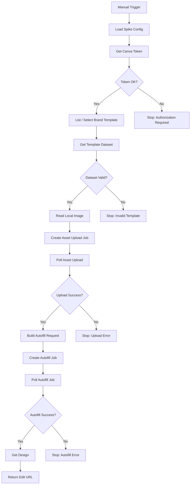

# CANVA_INTEGRATION_SPIKE

**Projeto:** Automação de Rascunhos de Design com n8n + Canva  
**Documento:** Spike técnico de integração Canva ↔ n8n  
**Versão:** 1.0  
**Data:** 16/09/2026  
**Status:** Pronto para implementação  
**Documento relacionado:** `ARQUITETURA_N8N_AUTOMACAO_DESIGN_CANVA.md`

---

# 1. Objetivo do spike

Este spike existe para validar o principal risco técnico da arquitetura antes de investir tempo na camada de IA, RAG, seleção inteligente de imagens ou múltiplos clientes.

A pergunta que este spike deve responder é:

> **É possível iniciar manualmente um workflow no n8n local, autenticar na Canva Connect API, localizar um Brand Template, consultar seus campos de Data Autofill, enviar uma imagem local ao Canva, preencher imagem e texto no template e obter como resultado um novo design editável no Canva?**

O spike será considerado bem-sucedido quando esse fluxo funcionar de ponta a ponta para **um único template**, **uma única imagem** e **um pequeno conjunto de textos**.

---

# 2. Resultado esperado

Ao final do spike, o seguinte fluxo deverá funcionar:

```text
Designer
   │
   │ Execute Workflow
   ▼
n8n local
   │
   ├── obtém token Canva válido
   │
   ├── localiza Brand Template de teste
   │
   ├── consulta dataset do template
   │
   ├── lê uma imagem local
   │
   ├── envia imagem ao Canva
   │
   ├── aguarda conclusão do upload
   │
   ├── obtém canva_asset_id
   │
   ├── monta payload de Autofill
   │
   ├── cria Autofill Job
   │
   ├── aguarda conclusão do job
   │
   ├── obtém design_id
   │
   ├── consulta metadados do design
   │
   └── retorna edit_url
   │
   ▼
Design editável no Canva
```

Exemplo de saída final esperada:

```json
{
  "status": "success",
  "brand_template_id": "DAGXXXXXXXX",
  "asset_id": "MXXXXXXXX",
  "autofill_job_id": "XXXXXXXX",
  "design_id": "DAGYYYYYYYY",
  "title": "SPIKE - Canva Autofill",
  "edit_url": "https://www.canva.com/...",
  "view_url": "https://www.canva.com/..."
}
```

---

# 3. O que este spike NÃO deve implementar

O spike deve permanecer pequeno.

Não implementar ainda:

- IA para escolha de imagens;
- embeddings;
- pgvector;
- Brand DNA;
- múltiplos clientes;
- múltiplos templates;
- geração de três variações;
- feedback do designer;
- aprendizado de preferências;
- seleção automática de template;
- seleção automática de assets;
- copywriting por IA;
- publicação em redes sociais;
- banco de produção completo;
- interface final para o designer;
- sincronização de toda a biblioteca de imagens com Canva.

O objetivo é validar **somente o caminho técnico Canva ↔ n8n**.

---

# 4. Critérios de sucesso

O spike será aprovado somente se todos os critérios abaixo forem atendidos.

- [ ] A integração Canva é criada no Canva Developer Portal.
- [ ] OAuth 2.0 + PKCE funciona localmente.
- [ ] O sistema consegue renovar um access token sem nova autorização manual.
- [ ] n8n consegue listar Brand Templates disponíveis.
- [ ] n8n consegue obter o dataset de um Brand Template.
- [ ] O dataset possui ao menos um campo de imagem e um campo de texto.
- [ ] n8n consegue ler uma imagem a partir do volume local `/workspace`.
- [ ] A imagem é enviada com sucesso à biblioteca do Canva.
- [ ] O workflow aguarda corretamente o término do upload assíncrono.
- [ ] O `asset_id` retornado é capturado.
- [ ] O payload de Autofill é validado contra o dataset.
- [ ] Um Autofill Job é iniciado.
- [ ] O workflow aguarda corretamente o término do Autofill Job.
- [ ] Um novo `design_id` é retornado.
- [ ] O sistema obtém uma `edit_url`.
- [ ] A URL abre um design editável no Canva.
- [ ] A imagem correta aparece no campo de imagem.
- [ ] O texto correto aparece no campo de texto.
- [ ] O template original não é alterado.

---

# 5. Decisão arquitetural do spike

## 5.1. n8n continua sendo o orquestrador

O n8n será responsável por:

- iniciar o teste manualmente;
- carregar variáveis;
- chamar a Canva Connect API;
- enviar o arquivo;
- fazer polling dos jobs assíncronos;
- validar respostas;
- produzir o resultado final;
- registrar erros de forma legível.

## 5.2. Canva continua sendo o renderer/editor

O Canva será responsável por:

- hospedar o Brand Template;
- manter fontes, logo, grid, cores e composição;
- receber o asset;
- substituir campos de Autofill;
- criar o novo design;
- disponibilizar o resultado para edição manual.

## 5.3. OAuth será tratado como componente separado

Para o spike, recomenda-se tratar OAuth como um pequeno componente isolado.

Existem duas opções:

### Opção A — preferida para o spike

Criar um pequeno serviço local `canva-auth` em Node.js.

Responsabilidades:

```text
GET /auth/canva/start
GET /auth/canva/callback
GET /auth/canva/token
POST /auth/canva/refresh
GET /health
```

O serviço:

- gera `code_verifier`;
- gera `code_challenge`;
- gera e valida `state`;
- recebe o callback do Canva;
- troca authorization code por tokens;
- persiste refresh token localmente;
- renova access token quando necessário;
- nunca entrega `client_secret` ao navegador.

### Opção B — validar posteriormente

Testar se a credencial OAuth2 genérica da versão do n8n instalada atende integralmente ao fluxo PKCE exigido pelo Canva.

**Não assumir isso sem teste.**

A Opção A é recomendada inicialmente porque torna o fluxo OAuth explícito, testável e independente de mudanças na UI de credenciais do n8n.

---

# 6. Requisitos do ambiente

## 6.1. Software

Recomendado:

```text
Docker Desktop / Docker Engine
Docker Compose
n8n self-hosted
Node.js 20+ para o serviço canva-auth
Git
Browser
Conta Canva com acesso aos recursos necessários
```

## 6.2. Estrutura de diretórios

```text
design-automation/
├── docs/
│   ├── ARQUITETURA_N8N_AUTOMACAO_DESIGN_CANVA.md
│   └── CANVA_INTEGRATION_SPIKE.md
│
├── workflows/
│   └── spike-canva-autofill.json
│
├── services/
│   └── canva-auth/
│       ├── src/
│       │   ├── server.ts
│       │   ├── canva-oauth.ts
│       │   └── token-store.ts
│       ├── package.json
│       └── tsconfig.json
│
├── workspace/
│   └── spike/
│       └── test-image.jpg
│
├── .env
├── .env.example
├── docker-compose.yml
└── README.md
```

---

# 7. Configuração no Canva Developer Portal

Criar uma integração dedicada ao projeto.

Sugestão de nome:

```text
Agency Design Automation - Local Dev
```

## 7.1. Redirect URL

Para desenvolvimento local, utilizar:

```text
http://127.0.0.1:3001/auth/canva/callback
```

**Importante:** a documentação do Canva permite `127.0.0.1` para desenvolvimento local e informa que `localhost` não é aceito como redirect URL local.

Se outra porta for usada, manter a mesma porta no:

- Canva Developer Portal;
- `.env`;
- serviço `canva-auth`.

---

# 8. Scopes mínimos recomendados

Selecionar apenas os scopes necessários.

Para o spike:

```text
asset:read
asset:write
brandtemplate:meta:read
brandtemplate:content:read
design:content:write
design:meta:read
```

Finalidade:

| Scope | Uso |
|---|---|
| `asset:read` | consultar resultado/metadados de assets |
| `asset:write` | enviar imagem para Canva |
| `brandtemplate:meta:read` | listar/localizar Brand Templates |
| `brandtemplate:content:read` | consultar dataset do template |
| `design:content:write` | criar design via Autofill |
| `design:meta:read` | obter `edit_url`, `view_url` e metadados |

Não adicionar scopes de escrita de Brand Template neste spike.

---

# 9. Restrição importante do Autofill

A arquitetura desejada usa a API oficial de Autofill.

No momento desta especificação:

- APIs de Brand Template podem ser utilizadas por planos Canva com acesso a Brand Templates;
- para o uso de Autofill em produção, a integração deve atuar em nome de um usuário pertencente a uma organização Canva Enterprise;
- planos pagos podem possuir uma cota limitada de teste durante o desenvolvimento da integração.

Portanto, um dos primeiros resultados do spike deve ser classificado como:

```text
CANVA_AUTOFILL_CAPABILITY =
  AVAILABLE
  | DEVELOPMENT_TRIAL
  | BLOCKED_BY_PLAN
```

Se o retorno for `BLOCKED_BY_PLAN`, o spike ainda é útil: ele confirma que a arquitetura está correta até o ponto da restrição comercial.

---

# 10. Preparação do Brand Template de teste

Antes de executar o workflow, preparar manualmente um template simples no Canva.

## 10.1. Estrutura visual

Criar um design com apenas:

```text
┌───────────────────────────────┐
│                               │
│      [COVER_IMAGE]            │
│                               │
│  [HEADLINE]                   │
│  [SUBHEADLINE]                │
│                               │
└───────────────────────────────┘
```

Não testar um carrossel completo inicialmente.

## 10.2. Campos de Data Autofill

Usando o recurso Data Autofill do Canva, configurar:

```text
COVER_IMAGE    -> image
HEADLINE       -> text
SUBHEADLINE    -> text
```

Usar nomes simples, em letras maiúsculas e sem espaços.

## 10.3. Publicação

Publicar o design como Brand Template.

Salvar no projeto:

```text
CANVA_TEST_TEMPLATE_NAME="SPIKE - Social Post Template"
```

Se o ID for conhecido antecipadamente:

```text
CANVA_TEST_BRAND_TEMPLATE_ID="..."
```

No primeiro teste é interessante localizar o template pela API para confirmar que a listagem funciona.

---

# 11. Variáveis de ambiente

Criar `.env.example`:

```bash
# -------------------------------------------------
# CANVA
# -------------------------------------------------

CANVA_CLIENT_ID=
CANVA_CLIENT_SECRET=

CANVA_REDIRECT_URI=http://127.0.0.1:3001/auth/canva/callback

CANVA_AUTH_URL=https://www.canva.com/api/oauth/authorize
CANVA_TOKEN_URL=https://api.canva.com/rest/v1/oauth/token
CANVA_API_BASE_URL=https://api.canva.com/rest/v1

CANVA_SCOPES="asset:read asset:write brandtemplate:meta:read brandtemplate:content:read design:content:write design:meta:read"

CANVA_TEST_TEMPLATE_NAME="SPIKE - Social Post Template"
CANVA_TEST_BRAND_TEMPLATE_ID=

# -------------------------------------------------
# LOCAL AUTH SERVICE
# -------------------------------------------------

CANVA_AUTH_HOST=0.0.0.0
CANVA_AUTH_PORT=3001

TOKEN_STORE_PATH=/data/canva-token.json

# -------------------------------------------------
# N8N
# -------------------------------------------------

N8N_PORT=5678

# -------------------------------------------------
# SPIKE
# -------------------------------------------------

SPIKE_IMAGE_PATH=/workspace/spike/test-image.jpg
SPIKE_HEADLINE="Winter 26"
SPIKE_SUBHEADLINE="New Collection"
SPIKE_DESIGN_TITLE="SPIKE - Canva Autofill"
```

O arquivo `.env` real não deve ser commitado.

Adicionar ao `.gitignore`:

```text
.env
data/canva-token.json
*.token.json
```

---

# 12. OAuth 2.0 + PKCE

A Canva Connect API utiliza:

```text
OAuth 2.0
Authorization Code Flow
PKCE
SHA-256 / S256
```

## 12.1. Etapa 1 — gerar code_verifier

Gerar string criptograficamente aleatória.

Requisitos:

- alta entropia;
- entre 43 e 128 caracteres;
- caracteres permitidos conforme PKCE.

Pseudo-código:

```ts
const codeVerifier = crypto.randomBytes(64).toString("base64url");
```

## 12.2. Etapa 2 — gerar code_challenge

```ts
const codeChallenge = crypto
  .createHash("sha256")
  .update(codeVerifier)
  .digest("base64url");
```

## 12.3. Etapa 3 — gerar state

```ts
const state = crypto.randomBytes(64).toString("base64url");
```

O `state` deve ser persistido temporariamente e validado no callback.

## 12.4. Etapa 4 — abrir autorização

Construir URL:

```text
https://www.canva.com/api/oauth/authorize
```

com parâmetros:

```text
code_challenge
code_challenge_method=s256
scope
response_type=code
client_id
state
redirect_uri
```

Exemplo conceitual:

```text
https://www.canva.com/api/oauth/authorize
?code_challenge=...
&code_challenge_method=s256
&scope=asset%3Aread%20asset%3Awrite...
&response_type=code
&client_id=...
&state=...
&redirect_uri=http%3A%2F%2F127.0.0.1%3A3001%2Fauth%2Fcanva%2Fcallback
```

## 12.5. Etapa 5 — receber callback

Exemplo:

```text
GET /auth/canva/callback?code=XXXX&state=YYYY
```

Validar:

```text
received_state === stored_state
```

Se não for igual:

```text
HTTP 400
OAuth state mismatch
```

## 12.6. Etapa 6 — trocar code por token

Endpoint:

```text
POST https://api.canva.com/rest/v1/oauth/token
```

Headers:

```text
Authorization: Basic base64(CANVA_CLIENT_ID:CANVA_CLIENT_SECRET)
Content-Type: application/x-www-form-urlencoded
```

Body:

```text
grant_type=authorization_code
code_verifier=<original verifier>
code=<authorization code>
redirect_uri=<configured redirect uri>
```

Persistir:

```json
{
  "access_token": "...",
  "refresh_token": "...",
  "expires_at": 0,
  "scope": "..."
}
```

Nunca versionar esse arquivo.

---

# 13. Renovação de token

O spike deve implementar refresh token desde o início.

Não depender de reautorizar manualmente toda vez que o access token expirar.

Endpoint:

```text
POST https://api.canva.com/rest/v1/oauth/token
```

Headers:

```text
Authorization: Basic base64(CLIENT_ID:CLIENT_SECRET)
Content-Type: application/x-www-form-urlencoded
```

Body:

```text
grant_type=refresh_token
refresh_token=<refresh_token>
```

Após refresh:

1. sobrescrever `access_token`;
2. sobrescrever `refresh_token` caso um novo seja retornado;
3. recalcular `expires_at`;
4. persistir atomicamente.

## Regra

O endpoint local:

```text
GET /auth/canva/token
```

deve retornar um access token válido.

Pseudo-lógica:

```text
if token does not exist:
    return needs_authorization

if token expires in > 5 minutes:
    return current access token

else:
    refresh token
    save new token
    return new access token
```

---

# 14. Segurança mínima do spike

Mesmo sendo desenvolvimento local:

- nunca colocar `CANVA_CLIENT_SECRET` dentro de Code Nodes do n8n;
- nunca escrever tokens nos logs;
- nunca salvar tokens no Git;
- usar `state` no OAuth;
- manter token store fora de `/workspace` compartilhado com assets;
- não retornar refresh token para o n8n se não for necessário;
- limitar o serviço `canva-auth` à máquina local;
- evitar exposição pública da porta 3001.

Resposta de `/auth/canva/token`:

```json
{
  "status": "ok",
  "access_token": "***runtime-value***",
  "expires_at": 1780000000
}
```

O access token pode ser usado temporariamente pelo workflow, mas não deve ser persistido em outputs permanentes.

---

# 15. Docker Compose — desenho mínimo

Exemplo conceitual:

```yaml
services:

  n8n:
    image: n8nio/n8n:latest
    ports:
      - "5678:5678"
    volumes:
      - n8n_data:/home/node/.n8n
      - ./workspace:/workspace
    env_file:
      - .env
    extra_hosts:
      - "host.docker.internal:host-gateway"

  canva-auth:
    build:
      context: ./services/canva-auth
    ports:
      - "3001:3001"
    env_file:
      - .env
    volumes:
      - canva_auth_data:/data

volumes:
  n8n_data:
  canva_auth_data:
```

Se `canva-auth` estiver em outro container da mesma rede Docker, o n8n pode acessá-lo internamente por:

```text
http://canva-auth:3001
```

O navegador continua usando:

```text
http://127.0.0.1:3001
```

para iniciar e concluir OAuth.

---

# 16. Workflow n8n do spike

Nome recomendado:

```text
SPIKE - Canva Autofill E2E
```

Trigger:

```text
Manual Trigger
```

O workflow pode ser dividido em nove blocos.

---

# 17. Bloco A — Configuração

## Node A1 — Manual Trigger

```text
Manual Trigger
```

## Node A2 — Set / Edit Fields: Spike Config

Produzir:

```json
{
  "template_name": "SPIKE - Social Post Template",
  "template_id": "",
  "image_path": "/workspace/spike/test-image.jpg",
  "headline": "Winter 26",
  "subheadline": "New Collection",
  "design_title": "SPIKE - Canva Autofill"
}
```

Em implementação posterior esses valores virão do briefing.

---

# 18. Bloco B — Obter token válido

## Node B1 — HTTP Request: Get Canva Token

```text
GET http://canva-auth:3001/auth/canva/token
```

Resposta esperada:

```json
{
  "status": "ok",
  "access_token": "...",
  "expires_at": 1780000000
}
```

Se:

```json
{
  "status": "authorization_required"
}
```

interromper com mensagem:

```text
Autorize primeiro:
http://127.0.0.1:3001/auth/canva/start
```

---

# 19. Bloco C — Localizar Brand Template

Há duas estratégias.

## Estratégia 1 — ID fixo

Se:

```text
CANVA_TEST_BRAND_TEMPLATE_ID
```

estiver configurado, utilizá-lo diretamente.

## Estratégia 2 — listar templates

Endpoint:

```text
GET https://api.canva.com/rest/v1/brand-templates
```

Header:

```text
Authorization: Bearer {{$json.access_token}}
```

Localizar pelo título/nome esperado.

## Regra do spike

Na primeira execução, testar a listagem.

Depois de confirmado, persistir o ID para reduzir ambiguidade.

Saída:

```json
{
  "brand_template_id": "DAGXXXXXXXX"
}
```

---

# 20. Bloco D — Consultar dataset do template

Endpoint:

```text
GET https://api.canva.com/rest/v1/brand-templates/{brandTemplateId}/dataset
```

Header:

```text
Authorization: Bearer <access_token>
```

Resposta esperada conceitualmente:

```json
{
  "dataset": {
    "COVER_IMAGE": {
      "type": "image"
    },
    "HEADLINE": {
      "type": "text"
    },
    "SUBHEADLINE": {
      "type": "text"
    }
  }
}
```

## Validação obrigatória

Antes de continuar, verificar:

```text
COVER_IMAGE exists
COVER_IMAGE.type == image

HEADLINE exists
HEADLINE.type == text

SUBHEADLINE exists
SUBHEADLINE.type == text
```

Se algum campo não existir:

```text
FAIL FAST
```

Exemplo:

```json
{
  "status": "failed",
  "stage": "template_dataset_validation",
  "missing_fields": [
    "COVER_IMAGE"
  ]
}
```

Essa validação é importante porque um campo incorreto no payload de Autofill pode ser ignorado sem produzir o resultado desejado.

---

# 21. Bloco E — Ler imagem local

A imagem de teste:

```text
/workspace/spike/test-image.jpg
```

deve estar montada dentro do container n8n.

Utilizar o node apropriado da versão instalada para ler arquivo do disco em modo binário.

Resultado:

```text
binary.data
```

Validar:

```text
file exists
mime type supported
file size < 50 MB
```

Formatos de imagem suportados pela Assets API incluem, entre outros:

```text
JPEG
PNG
HEIC
TIFF
single-frame GIF
single-frame WEBP
```

Para o spike usar JPEG ou PNG.

---

# 22. Bloco F — Upload do asset

## Endpoint

```text
POST https://api.canva.com/rest/v1/asset-uploads
```

Headers:

```text
Authorization: Bearer <access_token>
Content-Type: application/octet-stream
Asset-Upload-Metadata: {"name_base64":"<BASE64_NAME>"}
```

O corpo da requisição é o binário do arquivo.

## Nome

Exemplo:

```text
spike-test-image
```

Codificar em Base64 antes de inserir no header:

```text
Asset-Upload-Metadata
```

## Resposta inicial

O Canva retorna um job assíncrono.

Conceitualmente:

```json
{
  "job": {
    "id": "UPLOAD_JOB_ID",
    "status": "in_progress"
  }
}
```

Não assumir que o asset está pronto imediatamente.

---

# 23. Bloco G — Polling do upload

Endpoint:

```text
GET https://api.canva.com/rest/v1/asset-uploads/{jobId}
```

Estados possíveis:

```text
in_progress
success
failed
```

Workflow:

```text
Get upload job
      │
      ├── success ──> continuar
      │
      ├── failed ───> encerrar
      │
      └── in_progress
               │
               ▼
             Wait
               │
               └────> repetir
```

## Intervalo inicial recomendado

```text
2 segundos
```

## Limite do spike

```text
máximo 30 tentativas
```

ou aproximadamente:

```text
60 segundos
```

Se exceder:

```json
{
  "status": "failed",
  "stage": "asset_upload_polling",
  "error": "timeout"
}
```

## Resultado de sucesso

Capturar:

```text
job.asset.id
```

Exemplo:

```json
{
  "canva_asset_id": "Msd59349ff"
}
```

---

# 24. Bloco H — Construir payload de Autofill

Payload:

```json
{
  "type": "create_from_brand_template",
  "brand_template_id": "DAGXXXXXXXX",
  "title": "SPIKE - Canva Autofill",
  "data": {
    "COVER_IMAGE": {
      "type": "image",
      "asset_id": "Msd59349ff"
    },
    "HEADLINE": {
      "type": "text",
      "text": "Winter 26"
    },
    "SUBHEADLINE": {
      "type": "text",
      "text": "New Collection"
    }
  }
}
```

## Regra arquitetural

O payload **não deve ser hardcoded diretamente na chamada HTTP**.

Primeiro criar um objeto intermediário:

```text
AutofillRequest
```

Depois validar esse objeto.

No sistema futuro, o `CreativePlan` será convertido nesse formato.

---

# 25. Bloco I — Criar Autofill Job

Endpoint:

```text
POST https://api.canva.com/rest/v1/autofills
```

Headers:

```text
Authorization: Bearer <access_token>
Content-Type: application/json
```

Body:

```text
AutofillRequest
```

A operação é assíncrona.

Capturar:

```text
job.id
```

Exemplo:

```json
{
  "autofill_job_id": "XXXXXXXX"
}
```

---

# 26. Bloco J — Polling do Autofill

Endpoint:

```text
GET https://api.canva.com/rest/v1/autofills/{jobId}
```

Estados:

```text
in_progress
success
failed
```

Estrutura:

```text
Get autofill job
      │
      ├── success ──> capturar design
      │
      ├── failed ───> encerrar
      │
      └── in_progress
               │
               ▼
             Wait
               │
               └────> repetir
```

Recomendação:

```text
intervalo: 2 segundos
tentativas: 30
```

Ao finalizar com sucesso:

```text
capturar design.id
```

---

# 27. Bloco K — Obter design editável

Endpoint:

```text
GET https://api.canva.com/rest/v1/designs/{designId}
```

Scope necessário:

```text
design:meta:read
```

Extrair:

```text
design.id
design.title
design.urls.edit_url
design.urls.view_url
design.page_count
```

Observação:

As URLs de edição e visualização retornadas pela API são temporárias. O banco deve considerar `design_id` como identificador principal, e não tratar a URL como identificador permanente.

---

# 28. Resposta final do workflow

Produzir um objeto único:

```json
{
  "status": "success",
  "source": {
    "brand_template_id": "DAGXXXXXXXX",
    "template_name": "SPIKE - Social Post Template"
  },
  "asset": {
    "local_path": "/workspace/spike/test-image.jpg",
    "canva_asset_id": "Msd59349ff"
  },
  "autofill": {
    "job_id": "XXXXXXXX"
  },
  "design": {
    "id": "DAGYYYYYYYY",
    "title": "SPIKE - Canva Autofill",
    "edit_url": "https://www.canva.com/...",
    "view_url": "https://www.canva.com/..."
  }
}
```

No n8n, deixar o `edit_url` visível no último node.

---

# 29. Fluxo n8n resumido



---

# 30. Organização recomendada em sub-workflows

Mesmo no spike, vale separar os módulos reutilizáveis.

## WF-SPIKE-01 — Canva Token

Entrada:

```json
{}
```

Saída:

```json
{
  "access_token": "...",
  "expires_at": 0
}
```

## WF-SPIKE-02 — Ensure Canva Asset

Entrada:

```json
{
  "file_path": "/workspace/spike/test-image.jpg",
  "asset_name": "spike-test-image"
}
```

Saída:

```json
{
  "asset_id": "..."
}
```

## WF-SPIKE-03 — Get Template Dataset

Entrada:

```json
{
  "brand_template_id": "..."
}
```

Saída:

```json
{
  "dataset": {}
}
```

## WF-SPIKE-04 — Create Canva Draft

Entrada:

```json
{
  "brand_template_id": "...",
  "title": "...",
  "data": {}
}
```

Saída:

```json
{
  "design_id": "...",
  "edit_url": "..."
}
```

## WF-SPIKE-MAIN

Coordena os quatro anteriores.

Essa separação facilita migrar do spike para produção.

---

# 31. Contrato futuro: Canva Adapter

Após o spike, os nodes podem ser reorganizados sob uma interface lógica.

```ts
interface CanvaAdapter {
  getValidAccessToken(): Promise<string>;

  listBrandTemplates(): Promise<BrandTemplate[]>;

  getBrandTemplateDataset(
    brandTemplateId: string
  ): Promise<TemplateDataset>;

  uploadAsset(
    localPath: string,
    name: string
  ): Promise<CanvaAsset>;

  createDraftFromBrandTemplate(
    brandTemplateId: string,
    title: string,
    data: AutofillData
  ): Promise<CanvaDraft>;

  getDesign(
    designId: string
  ): Promise<CanvaDesign>;
}
```

O sistema de IA não deverá conhecer endpoints do Canva.

Ele deverá produzir apenas:

```text
CreativePlan
```

O Canva Adapter transforma esse plano em chamadas de API.

---

# 32. Modelo de erro padronizado

Todos os sub-workflows devem retornar erro no mesmo formato.

```json
{
  "status": "failed",
  "stage": "asset_upload",
  "code": "CANVA_ASSET_UPLOAD_FAILED",
  "message": "Human-readable message",
  "retryable": true,
  "context": {
    "job_id": "..."
  }
}
```

Exemplos de `stage`:

```text
oauth
token_refresh
brand_template_lookup
template_dataset
template_dataset_validation
read_local_asset
asset_upload
asset_upload_polling
autofill_request_validation
autofill_create
autofill_polling
design_lookup
```

---

# 33. Tratamento de erros prioritários

## 401 — Unauthorized

Possíveis causas:

- access token expirou;
- token inválido;
- refresh falhou.

Ação:

```text
refresh once
retry request once
```

Se persistir:

```text
fail
reauthorization_required
```

## 403 — Forbidden

Possíveis causas:

- scope ausente;
- recurso sem permissão;
- limitação do plano Canva;
- Autofill não disponível para a conta.

Não repetir indefinidamente.

Registrar:

```text
CANVA_PERMISSION_OR_PLAN_ERROR
```

## 404 — Not Found

Possíveis causas:

- Brand Template removido;
- `template_id` antigo;
- asset removido;
- design removido.

## 429 — Rate Limit

Estratégia:

```text
Wait
Exponential Backoff
Retry
```

Exemplo:

```text
2s
4s
8s
16s
```

Manter limite máximo de retries.

## Dataset incompatível

Erro local, não de API.

Exemplo:

```json
{
  "code": "TEMPLATE_SCHEMA_MISMATCH",
  "expected": {
    "COVER_IMAGE": "image",
    "HEADLINE": "text"
  },
  "received": {
    "HERO_IMAGE": "image",
    "HEADLINE": "text"
  }
}
```

---

# 34. Idempotência e duplicação de assets

O spike poderá subir a mesma imagem mais de uma vez.

Isso é aceitável inicialmente.

Entretanto, logo após a validação técnica, implementar:

```text
local_asset_hash -> canva_asset_id
```

Exemplo:

```text
SHA-256(file)
```

Banco futuro:

```text
asset_sync
-----------------------------
local_asset_id
sha256
canva_asset_id
canva_uploaded_at
canva_asset_status
```

Lógica:

```text
if sha256 exists and canva_asset_id valid:
    reuse asset
else:
    upload to Canva
```

Isso evitará dezenas de cópias da mesma fotografia.

---

# 35. Naming conventions

Usar padrão consistente.

## Brand Template

```text
[CLIENTE] - [FORMATO] - [VARIANTE]
```

Exemplo:

```text
MARCA_A - CAROUSEL_05 - EDITORIAL_01
```

## Campos de Autofill

```text
SLIDE_01_IMAGE
SLIDE_01_HEADLINE
SLIDE_01_SUBHEADLINE

SLIDE_02_IMAGE
SLIDE_02_HEADLINE

SLIDE_05_CTA
```

Evitar:

```text
imagem capa
Foto 1
texto novo
Título principal
```

Os campos devem funcionar como uma API interna entre o sistema e o template.

---

# 36. Regra futura para carrosséis

Quando o spike de uma página funcionar, criar um template de cinco páginas.

Exemplo:

```text
SLIDE_01_IMAGE
SLIDE_01_HEADLINE
SLIDE_01_SUBHEADLINE

SLIDE_02_IMAGE
SLIDE_02_HEADLINE

SLIDE_03_IMAGE
SLIDE_03_HEADLINE

SLIDE_04_IMAGE
SLIDE_04_HEADLINE

SLIDE_05_IMAGE
SLIDE_05_CTA
```

O futuro `CreativePlan`:

```json
{
  "template_id": "DAG...",
  "title": "MARCA A - Coleção Inverno",
  "slides": [
    {
      "page": 1,
      "image_asset_id": "asset-local-01",
      "headline": "Winter 26",
      "subheadline": "New Collection"
    },
    {
      "page": 2,
      "image_asset_id": "asset-local-02",
      "headline": "Designed for movement"
    }
  ]
}
```

O Canva Adapter converte para:

```json
{
  "data": {
    "SLIDE_01_IMAGE": {
      "type": "image",
      "asset_id": "CANVA_ASSET_01"
    },
    "SLIDE_01_HEADLINE": {
      "type": "text",
      "text": "Winter 26"
    },
    "SLIDE_01_SUBHEADLINE": {
      "type": "text",
      "text": "New Collection"
    },
    "SLIDE_02_IMAGE": {
      "type": "image",
      "asset_id": "CANVA_ASSET_02"
    },
    "SLIDE_02_HEADLINE": {
      "type": "text",
      "text": "Designed for movement"
    }
  }
}
```

---

# 37. Persistência mínima após o spike

Não é necessário PostgreSQL para provar a integração.

Durante o spike:

```text
token -> volume canva_auth_data
template id -> .env
asset id -> output do workflow
design id -> output do workflow
```

Depois de aprovado, migrar para PostgreSQL.

Tabelas futuras:

```text
canva_connections
canva_assets
canva_templates
canva_template_fields
canva_drafts
```

---

# 38. Dados que deverão ser persistidos futuramente

## canva_templates

```text
id
brand_id
canva_brand_template_id
name
format
variant
active
dataset_json
dataset_checked_at
created_at
updated_at
```

## canva_assets

```text
id
local_asset_id
sha256
canva_asset_id
uploaded_at
last_verified_at
status
```

## canva_drafts

```text
id
job_id
brand_id
template_id
canva_autofill_job_id
canva_design_id
title
created_at
status
```

Não persistir `edit_url` como dado permanente principal.

Persistir:

```text
canva_design_id
```

e regenerar/consultar a URL quando necessário.

---

# 39. Testes obrigatórios

## Teste 1 — OAuth inicial

Dado:

```text
sem tokens locais
```

Quando:

```text
abrir /auth/canva/start
```

Então:

```text
Canva solicita autorização
callback é recebido
token é persistido
```

## Teste 2 — Token refresh

Dado:

```text
access token considerado expirado
refresh token válido
```

Quando:

```text
GET /auth/canva/token
```

Então:

```text
novo access token é obtido
workflow não exige login manual
```

## Teste 3 — Lista de templates

Esperado:

```text
template de teste aparece na API
```

## Teste 4 — Dataset

Esperado:

```text
COVER_IMAGE = image
HEADLINE = text
SUBHEADLINE = text
```

## Teste 5 — Asset upload

Esperado:

```text
upload job -> success
asset_id retornado
```

## Teste 6 — Autofill

Esperado:

```text
autofill job -> success
design_id retornado
```

## Teste 7 — Design final

Abrir:

```text
edit_url
```

Confirmar visualmente:

- imagem correta;
- headline correta;
- subheadline correta;
- tipografia do template preservada;
- logo preservada;
- composição preservada;
- arquivo editável.

---

# 40. Testes negativos

Também executar.

## Campo inexistente

Enviar internamente:

```text
NON_EXISTENT_FIELD
```

O validador local deve impedir a chamada ao Autofill.

## Imagem inexistente

```text
/workspace/spike/not-found.jpg
```

O workflow deve falhar antes da chamada ao Canva.

## Template inválido

Usar ID inexistente.

Erro deve ser classificado como:

```text
BRAND_TEMPLATE_NOT_FOUND
```

## Token inválido

Confirmar que refresh é tentado uma única vez.

## Upload timeout

Simular polling excedendo limite.

## Autofill timeout

Simular polling excedendo limite.

---

# 41. Logging

Cada execução deve possuir:

```text
run_id
```

Exemplo:

```text
spike_20260916_001
```

Logs estruturados:

```json
{
  "run_id": "spike_20260916_001",
  "stage": "asset_upload",
  "status": "started",
  "timestamp": "2026-09-16T14:00:00Z"
}
```

Não logar:

```text
client_secret
refresh_token
access_token completo
```

É aceitável logar:

```text
token_expires_at
template_id
upload_job_id
asset_id
autofill_job_id
design_id
```

---

# 42. Observabilidade mínima no n8n

No último node de cada etapa relevante, manter objetos legíveis.

Exemplo:

```json
{
  "step": "template_dataset",
  "ok": true,
  "brand_template_id": "...",
  "fields": [
    "COVER_IMAGE",
    "HEADLINE",
    "SUBHEADLINE"
  ]
}
```

Isso facilitará debugging no editor do n8n.

---

# 43. Definition of Done

O spike estará concluído quando:

1. o repositório puder ser clonado;
2. `.env.example` documentar todas as variáveis;
3. `docker compose up` iniciar n8n e `canva-auth`;
4. o usuário fizer OAuth uma vez;
5. o n8n for aberto em `http://127.0.0.1:5678`;
6. o workflow `SPIKE - Canva Autofill E2E` for executado manualmente;
7. uma imagem de `/workspace/spike/` for enviada ao Canva;
8. um Brand Template for preenchido;
9. um novo design for criado;
10. o último node devolver `design_id` e `edit_url`;
11. o design puder ser aberto e editado no Canva;
12. as limitações de plano da conta Canva forem documentadas.

---

# 44. Evidências a guardar ao concluir

Criar:

```text
docs/spike-results/
```

Salvar:

```text
canva-spike-result.md
```

com:

```text
Data:
Conta/plano Canva:
Template utilizado:
Template ID:
Campos encontrados:
Upload de asset: OK/FAIL
Autofill disponível: YES/TRIAL/NO
Autofill job: OK/FAIL
Design criado: OK/FAIL
Design ID:
Observações:
Bloqueios:
Próxima ação:
```

Não salvar tokens.

---

# 45. Decisão após o spike

## Cenário A — sucesso completo

```text
OAuth          OK
Brand Template OK
Asset Upload   OK
Autofill       OK
Editable Draft OK
```

Próximo passo:

```text
implementar WF-02 Index Assets
+
PostgreSQL/pgvector
+
CreativePlan schema
```

## Cenário B — tudo funciona, mas Autofill fica restrito por plano

```text
OAuth          OK
Brand Template OK
Asset Upload   OK
Autofill       BLOCKED_BY_PLAN
```

Próximo passo:

- decidir se a agência migra para Canva Enterprise;
- ou substituir apenas o último estágio por outro mecanismo;
- manter toda a camada de seleção, IA e Brand DNA intacta.

## Cenário C — OAuth/API inviável

Documentar o motivo exato antes de qualquer redesign arquitetural.

Não abandonar a arquitetura com base em erro não investigado.

---

# 46. Ordem recomendada de implementação para Codex / Claude Code / Cursor

Executar nesta sequência.

## Passo 1

Criar:

```text
services/canva-auth/
```

Implementar OAuth + PKCE.

## Passo 2

Criar `.env.example`.

## Passo 3

Criar `docker-compose.yml`.

## Passo 4

Validar manualmente:

```text
/auth/canva/start
/auth/canva/callback
/auth/canva/token
```

## Passo 5

Fazer uma chamada isolada para:

```text
GET /brand-templates
```

## Passo 6

Preparar Brand Template com Data Autofill.

## Passo 7

Testar:

```text
GET /brand-templates/{id}/dataset
```

## Passo 8

Criar workflow de upload de um asset.

## Passo 9

Criar polling de upload.

## Passo 10

Criar Autofill Request.

## Passo 11

Criar polling do Autofill.

## Passo 12

Consultar design.

## Passo 13

Abrir `edit_url` e validar manualmente.

## Passo 14

Exportar workflow n8n para:

```text
workflows/spike-canva-autofill.json
```

## Passo 15

Documentar o resultado.

---

# 47. Prompt de implementação sugerido para Codex / Claude Code

O conteúdo abaixo pode ser reutilizado no início da implementação:

```text
Leia primeiro:

1. docs/ARQUITETURA_N8N_AUTOMACAO_DESIGN_CANVA.md
2. docs/CANVA_INTEGRATION_SPIKE.md

Não implemente o sistema completo.

Sua tarefa atual é implementar exclusivamente o Canva Integration Spike.

Objetivo:

Provar que um workflow n8n self-hosted iniciado manualmente consegue:

1. obter um access token Canva válido usando OAuth 2.0 Authorization Code + PKCE;
2. listar Brand Templates;
3. consultar o dataset de um Brand Template;
4. ler uma imagem local de /workspace;
5. subir a imagem para o Canva;
6. aguardar o upload assíncrono;
7. criar um Autofill Job;
8. aguardar o Autofill Job;
9. obter o design_id;
10. obter a edit_url do novo design.

Restrições:

- não implementar IA;
- não implementar pgvector;
- não implementar seleção inteligente de imagem;
- não implementar múltiplos clientes;
- não implementar renderer local;
- não gerar imagens;
- não incluir secrets no código;
- não logar tokens;
- não alterar o Brand Template original;
- usar os endpoints oficiais atuais da Canva Connect API;
- validar o dataset antes do Autofill;
- tratar upload e Autofill como jobs assíncronos;
- implementar retry limitado;
- usar saída de erro estruturada.

Antes de alterar arquivos, apresente um plano curto dos arquivos que serão criados.

Depois implemente em etapas pequenas e verificáveis.

Não avance para funcionalidades fora do spike até que o caminho ponta a ponta esteja validado.
```

---

# 48. Endpoints Canva utilizados no spike

## OAuth Authorization

```text
GET https://www.canva.com/api/oauth/authorize
```

## Token / Refresh

```text
POST https://api.canva.com/rest/v1/oauth/token
```

## List Brand Templates

```text
GET https://api.canva.com/rest/v1/brand-templates
```

## Get Brand Template Dataset

```text
GET https://api.canva.com/rest/v1/brand-templates/{brandTemplateId}/dataset
```

## Create Asset Upload Job

```text
POST https://api.canva.com/rest/v1/asset-uploads
```

## Get Asset Upload Job

```text
GET https://api.canva.com/rest/v1/asset-uploads/{jobId}
```

## Create Autofill Job

```text
POST https://api.canva.com/rest/v1/autofills
```

## Get Autofill Job

```text
GET https://api.canva.com/rest/v1/autofills/{jobId}
```

## Get Design

```text
GET https://api.canva.com/rest/v1/designs/{designId}
```

---

# 49. Fontes oficiais usadas nesta especificação

Consultar novamente estas páginas antes da implementação caso a API tenha sido atualizada.

## Authentication

https://www.canva.dev/docs/connect/authentication/

## Creating integrations

https://www.canva.dev/docs/connect/creating-integrations/

## OAuth token endpoint

https://www.canva.dev/docs/connect/api-reference/authentication/generate-access-token/

## Scopes

https://www.canva.dev/docs/connect/appendix/scopes/

## Brand Templates

https://www.canva.dev/docs/connect/api-reference/brand-templates/

## List Brand Templates

https://www.canva.dev/docs/connect/api-reference/brand-templates/list-brand-templates/

## Get Brand Template Dataset

https://www.canva.dev/docs/connect/api-reference/brand-templates/get-brand-template-dataset/

## Assets

https://www.canva.dev/docs/connect/api-reference/assets/

## Create Asset Upload Job

https://www.canva.dev/docs/connect/api-reference/assets/create-asset-upload-job/

## Get Asset Upload Job

https://www.canva.dev/docs/connect/api-reference/assets/get-asset-upload-job/

## Autofill

https://www.canva.dev/docs/connect/api-reference/autofills/

## Autofill Guide

https://www.canva.dev/docs/connect/autofill-guide/

## Create Autofill Job

https://www.canva.dev/docs/connect/api-reference/autofills/create-design-autofill-job/

## Get Autofill Job

https://www.canva.dev/docs/connect/api-reference/autofills/get-design-autofill-job/

## Get Design

https://www.canva.dev/docs/connect/api-reference/designs/get-design/

---

# 50. Resumo executivo

O spike deve provar somente esta cadeia:

```text
n8n local
   ↓
OAuth Canva
   ↓
Brand Template
   ↓
Dataset
   ↓
Imagem local
   ↓
Canva Asset
   ↓
Autofill
   ↓
Novo Canva Design
   ↓
edit_url
```

Se essa cadeia funcionar, a camada de Canva deixa de ser o maior risco técnico do projeto.

A partir desse ponto, o restante do sistema pode ser desenvolvido ao redor de contratos estáveis:

```text
Asset Selection
      ↓
CreativePlan
      ↓
Canva Adapter
      ↓
Editable Draft
```

O spike não deve tentar ser inteligente.

Ele deve ser **determinístico, pequeno, observável e comprovável**.
